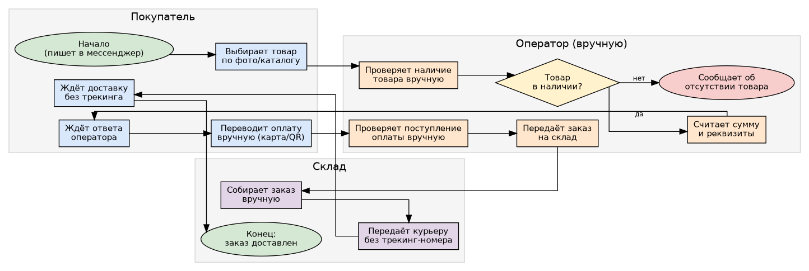
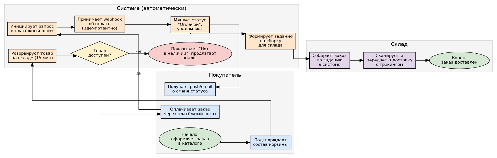
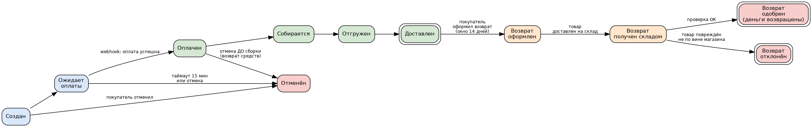
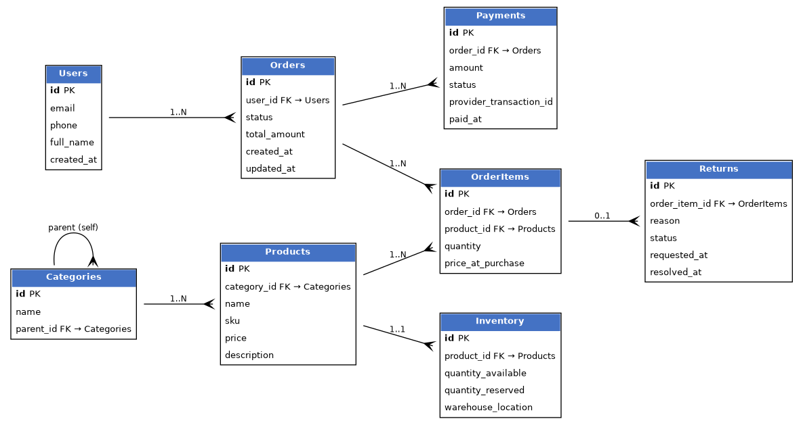
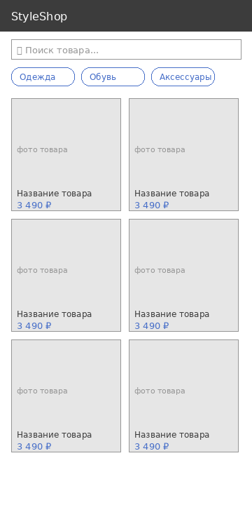
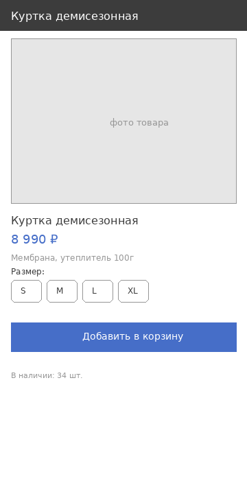
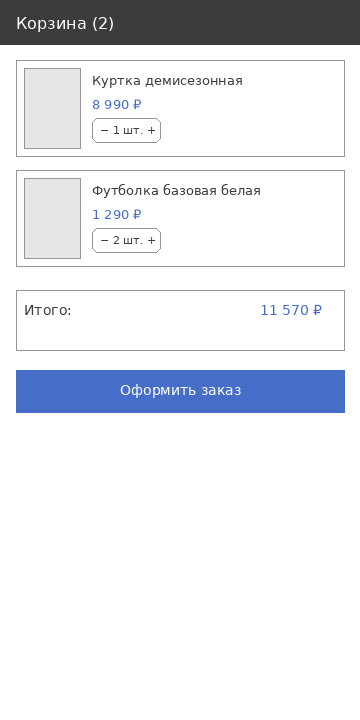
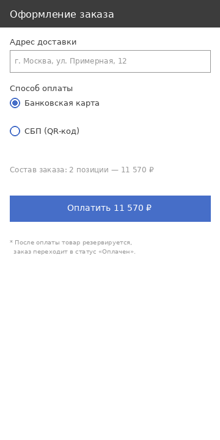
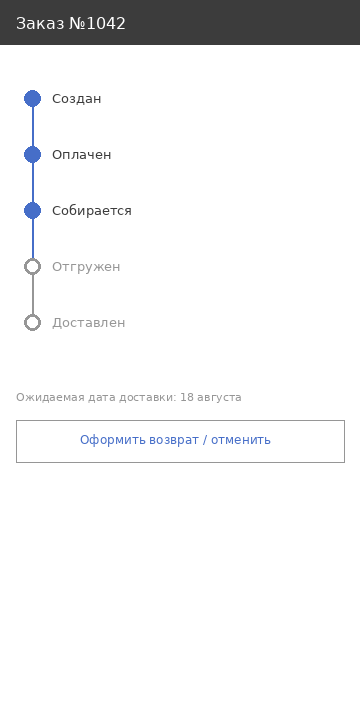

# StyleShop — аналитика e-commerce платформы (pet-проект)

Pet-проект системного аналитика: полный цикл проработки модуля **оформления заказа, оплаты и возврата товара** для интернет-магазина одежды — от Vision & Scope до рабочих SQL-запросов и API-спецификации.

Роль автора в проекте: системный аналитик — сбор требований (условных), моделирование процессов, проектирование данных и API, приоритизация бэклога, тестовые сценарии.

---

## Состав проекта

| Артефакт | Файл |
|---|---|
| Vision & Scope | [`docs/01_vision_scope.md`](docs/01_vision_scope.md) |
| BPMN As Is | [`docs/bpmn_as_is.png`](docs/bpmn_as_is.png) |
| BPMN To Be | [`docs/bpmn_to_be.png`](docs/bpmn_to_be.png) |
| State diagram (статусы заказа) | [`docs/state_diagram.png`](docs/state_diagram.png) |
| ERD (модель данных) | [`docs/erd.png`](docs/erd.png) |
| SQL-схема | [`sql/01_schema.sql`](sql/01_schema.sql) |
| SQL-запросы для отчётности | [`sql/03_reporting_queries.sql`](sql/03_reporting_queries.sql) |
| Результаты запросов на тестовых данных | [`docs/04_sql_results.md`](docs/04_sql_results.md) |
| OpenAPI-спецификация | [`api/openapi.yaml`](api/openapi.yaml) |
| User Stories + MoSCoW | [`docs/05_user_stories.md`](docs/05_user_stories.md) |
| Gherkin-сценарии | [`docs/06_order_returns.feature`](docs/06_order_returns.feature) |
| Wireframes ключевых экранов | [`wireframes/`](wireframes/) |

---

## Процесс: As Is → To Be

**As Is** — ручная обработка заказов через мессенджер, без автоматизации проверки остатков и подтверждения оплаты.



**To Be** — автоматическое резервирование товара, обработка оплаты через webhook, автоматическое формирование задания на сборку.



## Жизненный цикл заказа



## Модель данных



## Прототип интерфейса (wireframes)

Каталог → карточка товара → корзина → оформление заказа → статус заказа.

Макеты ниже — низкодетальные wireframes (аналитическая проработка экранов и переходов); финальный UI-прототип подразумевается в Figma на их основе.

| Каталог | Карточка товара | Корзина |
|---|---|---|
|  |  |  |

| Оформление заказа | Статус заказа |
|---|---|
|  |  |

---

## Как воспроизвести SQL-часть

```bash
cd sql
python3 02_seed_and_build.py   # создаёт db/styleshop.db и наполняет тестовыми данными
python3 04_run_queries.py      # выполняет запросы, сохраняет результаты в docs/04_sql_results.md
```

## Результат

- Сформирован полный пакет аналитической документации по e-commerce модулю: от бизнес-процессов до API-контракта.
- SQL-запросы проверены на реальных тестовых данных (40 заказов, 83 позиции, 5 возвратов).
- OpenAPI-спецификация валидна и содержит 11 эндпоинтов с обработкой ошибочных сценариев (409, 400, 404).
